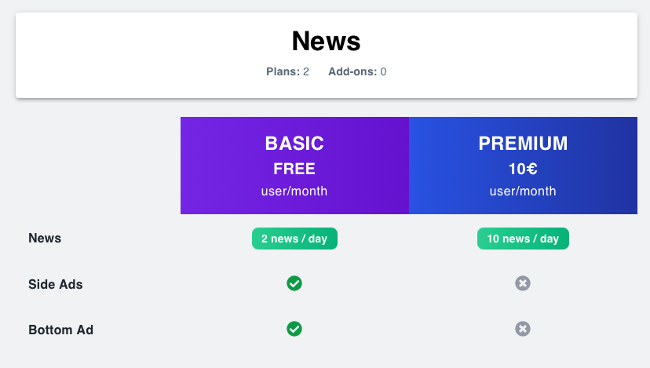

# SPACE Integration Lab — News Page Example

## 0. Overview and Objectives

This lab demonstrates how to integrate **SPACE** into a simple news application that initially has no pricing.

By the end of the tutorial, you will have a fully functional SaaS-like application that can:

- Control access to features according to user subscriptions.
- Track usage limits to prevent overages.
- Adapt its UI anytime the pricing changes.
- Adapt its UI anytime users novates their contract.

## 1. Pricing Overview

The version of the laboratory that you can find on the `main` branch does not include any pricing.

Our objective in this lab would be to integrate the following pricing into the app using SPACE:



It defines three simple features:

- **News** — The essential feature of the app, available to all plans but limited by the renewable usage limit `maxNews`.
- **Side Ads** — Controls whether ads appear on the sides of news articles.
- **Bottom Ads** — Controls whether an ad appears below each article.

This pricing serialized in `Pricing2Yaml` looks as follows:

```yaml
saasName: News
syntaxVersion: "3.0"
version: "1.0"
createdAt: "2025-09-01"
currency: EUR
features:
  news:
    description: Check SPACE news for free!
    valueType: BOOLEAN
    defaultValue: true
    expression: subscriptionContext['maxNews'] < pricingContext['usageLimits']['maxNews']
    type: DOMAIN
  sideAds:
    description: Disable the side ads!
    valueType: BOOLEAN
    defaultValue: true
    expression: pricingContext['features']['sideAds']
    type: DOMAIN
  bottomAd:
    description: Disable the bottom ads!
    valueType: BOOLEAN
    defaultValue: true
    expression: pricingContext['features']['bottomAd']
    type: DOMAIN
usageLimits:
  maxNews:
    valueType: NUMERIC
    defaultValue: 2
    unit: new
    type: RENEWABLE
    period:
      value: 1
      unit: DAY
    linkedFeatures:
      - news
plans:
  BASIC:
    description: Enjoy daily news about the SPACE!
    price: 0.0
    unit: user/month
  PREMIUM:
    description: Disable ads and read more news!
    price: 10.0
    unit: user/month
    features:
      sideAds:
        value: false
      bottomAd:
        value: false
    usageLimits:
      maxNews:
        value: 10
addOns: null
```

Nonetheless, you can also browse it in [**SphereLab**](https://sphere.score.us.es/pricings/sphere/News?collectionName=SphereLab).

## 2. Project Structure

The project consists of a simple web application divided into two main parts:

- **`server/`** — Express **backend** simulating API requests and serving article data.  
  Main file: `server/src/index.ts`

- **`src/`** — React **frontend** displaying news articles and ads.  
  Main file: `src/App.tsx`

## 3. Configuring SPACE and Basic Feature Toggling

In this section, you’ll connect the app to a SPACE instance and enable basic pricing-driven self-adaptation.

### Step 1 — Install Dependencies

```bash
npm install space-react-client space-node-client
# or
yarn add space-react-client space-node-client
# or
pnpm add space-react-client space-node-client
```

### Step 2 — Backend Integration (Server)

In `server/src/index.ts`, connect to your local SPACE instance:

```diff
// ...
// Resolve the frontend content articles directory from the monorepo roo
const articlesDir = path.join(__dirname, "static", "content", "articles");


+ const spaceClient: SpaceClient = connect({
+   url: "http://localhost:5403",
+   apiKey: "c52a83122dc0403567dc1d1af2f261da5dce9c49bee7e199b96ce3f4bfc85ac6",
+ });

app.get("/api/health", async (_req: Request, res: Response) => {...});

// ...
```

To keep this lab focused and avoid unnecessary complexity, **the application does not implement authentication** and therefore operates with a single user. We register a **listener** for the `synchronized` event, which triggers whenever a new connection to SPACE is established. In its callback, the application ensures the **test user’s contract exists** –creating it with the ID `user-123` if absent– and, if it does, simply resets the corresponding usage levels.

```diff
// ...
const spaceClient: SpaceClient = connect({
  url: "http://localhost:5403",
  apiKey: "c52a83122dc0403567dc1d1af2f261da5dce9c49bee7e199b96ce3f4bfc85ac6",
});

+ spaceClient.on("synchronized", async () => {
+   try {
+     await spaceClient.contracts.getContract(USER_ID);
+     await resetContractUsageLevels(USER_ID, spaceClient);
+     console.log("Contract exists, usage levels reset");
+   } catch {
+     spaceClient.contracts.addContract({
+       userContact: {
+         userId: USER_ID,
+         username: "testUser",
+       },
+       billingPeriod: {
+         autoRenew: true,
+         renewalDays: 30,
+       },
+       contractedServices: {
+         news: "1.0",
+       },
+       subscriptionPlans: {
+         news: "BASIC",
+       },
+       subscriptionAddOns: {},
+     });
+   }
+ });

// ...
```

### Step 3 — Add a Middleware for Pricing Tokens

After that, we should now configure the server-side [communication of SPACE](https://sphere-docs.vercel.app/docs/2.0.1/api/space/introduction#-communication-strategy-overview). In this communication model, each server response should include a special header called `PricingToken`, which carries a Json Web Token (JWT) containing up-to-date information about the current evaluation of features (see [Pricing Token Docs](https://sphere-docs.vercel.app/docs/2.0.1/api/space/introduction#-token-structure) for more information).

To support this behavior in an Express-based API, we’ll create a middleware responsible for generating the PricingToken (using SPACE of course) before every response and attaching it as a header. This ensures that all client components always receive the most recent feature evaluation state with each request. Create the middleware in the following file: `server/middlewares/pricingToken.ts`:

```ts
import { Request, Response, NextFunction } from "express";
import { SpaceClient } from "space-node-client";

// Middleware factory: generates a PricingToken for every response
const pricingTokenMiddleware = (spaceClient: SpaceClient, userId: string) => {
  return (_req: Request, res: Response, next: NextFunction) => {
    const setHeaders = async () => {
      try {
        const token = await spaceClient.features.generateUserPricingToken(userId);
        res.setHeader("PricingToken", token);
      } catch (error) {
        console.error("Error generating pricing token:", error);
      }
    };

    const wrap = (method: "send" | "json" | "end") => {
      const original = (res as any)[method];
      (res as any)[method] = async function (...args: any[]) {
        await setHeaders();
        return original.apply(this, args);
      };
    };

    wrap("send");
    wrap("json");
    wrap("end");
    next();
  };
};

export default featureChecker;
```

> [!INFO]
> **What is this middleware doing?**
> Well, it is not a middleware itself, it is a middleware factory –a function that returns a middleware. This allows the `spaceClient` and `userId`parameters to be passed in when configured on the server (see below). It intercepts the response methods (send, json, and end) to ensure that a fresh PricingToken is generated and attached to the response headers right before the server sends data back to the client.

Use it in your main server file:

```diff
// ...
spaceClient.on("synchronized", async () => {...});

+ app.use(featureChecker(spaceClient, USER_ID));
// ...
```

### Step 4 — Update the Article Endpoint

Now let’s ensure that fetching an article consumes one unit of `news` usage.

```diff
// ...
app.get("/api/articles/:id", async (req: Request, res: Response) => {
  try {
+    const evaluationResult = await spaceClient.features.evaluate(
+      USER_ID,
+      "news-news",
+      { "news-maxNews": 1 }
+    );

+    if (!evaluationResult.eval) {
+      return res
+        .status(400)
+        .json({
+          error:
+            "You have reached the limit of news. Come back tomorrow or upgrade your plan for more access!",
+        });
+    }
    const articles = loadAllArticlesFromDisk(articlesDir);
    const found = articles[Number(req.params.id)];
    if (!found) return res.status(404).json({ error: "Not found" });

    res.json(found);
  } catch (err) {
    res
      .status(500)
      .json({ error: "Failed to load article" });
  }
});
// ...
```

> [!TIP]
> Learn more about optimistic evaluation and error handling in the [SPACE Evaluation Docs](https://sphere-docs.vercel.app/docs/2.0.1/api/space/evaluation).

### Step 5 — Frontend Integration (React)

Replace the `<ShowAdsProvider>` provider with the **`<SpaceProvider>`** from `space-react-client`:

```diff
- import { ShowAdsProvider } from "./context/showAdsContext";
+ import { SpaceProvider } from "space-react-client";
// ...

function App() {

+  const spaceConfig = {
+    url: "http://localhost:5403",
+    apiKey: "c52a83122dc0403567dc1d1af2f261da5dce9c49bee7e199b96ce3f4bfc85ac6",
+    allowConnectionWithSpace: true
+  }

  return (
-    <ShowAdsProvider>
+    <SpaceProvider config={spaceConfig}>
       <MainPage />
+    </SpaceProvider>
-    </ShowAdsProvider>
  );
}

export default App;
```

### Step 6 — Keep the Pricing Token Updated

Then, given that the server is already configured to return updated pricing tokens as headers in its responses, it is time to configure the client to handle this and update the token on every request. In `src/hooks/useApi.tsx`, create a helper to update the token on every request:

```diff
//...

export default function useApi() {
+  // Minimal helper to update PricingToken and return JSON
+  async function fetchJson<T = any>(input: RequestInfo | URL, init?: RequestInit): Promise<T> {
+    const res = await fetch(input, init);
+    spaceClient.token.update(res.headers.get("PricingToken") || "");
+    return res.json();
+  }

  async function fetchArticle(id: number): Promise<Record<string, any>> {
-    const res = await fetch(`/api/articles/${id}`);
-    if (!res.ok) throw new Error(`API error ${res.status}`);
-    return res.json();
+    return fetchJson(`/api/articles/${id}`);
  }
}
```

### Step 7 — Toggle Features in the UI

With this configuration finished, you can now start using the `<Feature>` component to control the rendering of features in the UI. For example, to conditionally render the side ads based on the `sideAds` feature:

```tsx
// ...
export default function MainPage() {
  // ...

  return(
    {/* ... */}
    {/* Left Sidebar Ad */}
    <AnimatePresence>
+     <Feature id="news-sideAds">
+       <On>
          <LeftAd />
+       </On>
+     </Feature>
    </AnimatePresence>
    {/* ... */}
  )
}
```

> [!INFO]
> This replaces the old `useShowAds` logic. Any ad-related state should now be controlled via `<Feature>`.

> [!TIP]
> Remember that the `<Feature>` component can have up to four diferent children: `<On>`, `<Default>`, `<Loading>`, and `<ErrorFallback>`. Respectively:

> - `<On>`: Rendered when the feature access is evaluated as true by SPACE.
> - `<Default>`: Rendered when the feature access is evaluated as false by SPACE.
> - `<Loading>`: Rendered while the feature evaluation result is computing.
> - `<ErrorFallback>`: Rendered if there is an error while evaluating the feature.

This will render the left-side advertisement only if the user’s current subscription configuration allows it —that is, when the `sideAds` feature evaluates to `true` in the active pricing token.

## 4. (Optional) Switching Subscription Plans

This optional part of the laboratory adds a simple way to toggle between **BASIC** and **PREMIUM** plans.

### Backend

Add two endpoints to `server/src/index.ts`:

```ts
app.get("/api/subscription", async (req, res) => {
  const contract = await spaceClient.contracts.getContract(USER_ID);
  res.json({ subscriptionPlan: contract.subscriptionPlans.news });
});

app.put("/api/subscription", async (req, res) => {
  const plans = ["BASIC", "PREMIUM"] as const;
  const current = await spaceClient.contracts.getContract(USER_ID);
  const currentPlan = current.subscriptionPlans.news;
  const next = plans[(plans.indexOf(currentPlan as any) + 1) % plans.length];

  await spaceClient.contracts.updateContractSubscription(USER_ID, {
    contractedServices: { news: "1.0" },
    subscriptionPlans: { news: next },
    subscriptionAddOns: {},
  });

  res.json({ message: `Subscription updated to ${next}` });
});
```

### Frontend

In `useApi.tsx`, add:

```diff
export default function useApi() {
  // ...

+  async function getSubscriptionPlan() {
+    return fetchJson(`/api/subscription`);
+  }
+
+  async function updateSubscription() {
+    return fetchJson(`/api/subscription`, { method: "PUT" });
+  }

  return {
    fetchArticle,
+    getSubscriptionPlan,
+    updateSubscription
  }
}
```

Then, modify the header (`src/components/Header.tsx`) to show and toggle the current plan:

```diff
- import AdToggle from "./AdToggle";
+ import { useSpaceClient } from "space-react-client";
+ import { useEffect, useState } from "react";
+ import useApi from "../hooks/useApi";

export default function Header() {
+  const [currentPlan, setCurrentPlan] = useState("Loading...");
+  const { getSubscriptionPlan, updateSubscription } = useApi();
+
+  const spaceClient = useSpaceClient();
+
+  async function handlePlanChange(){
+    await updateSubscription();
+    setCurrentPlan(currentPlan === "BASIC" ? "PREMIUM" : "BASIC");
+    window.location.reload();
+  }
+
+  useEffect(() => {
+    getSubscriptionPlan().then(async (res) => {
+      setCurrentPlan(res.subscriptionPlan);
+    })
+  }, [spaceClient]);

  return (
    <header className="bg-white shadow-sm border-b">
      <div className="max-w-7xl mx-auto px-4 sm:px-6 lg:px-8">
        <div className="flex justify-between items-center py-4">
          <h1 className="text-3xl font-bold text-gray-900">Space News<span className="ml-2 text-sm font-normal text-gray-500">({currentPlan})</span></h1>
-          <AdToggle text="Ads" />
           {/* Plan Toggle Button */}
+          <button onClick={handlePlanChange} className="px-4 py-2 rounded-md bg-indigo-600 hover:bg-indigo-700 text-white text-sm font-medium shadow-sm">
+            Change Plan
+          </button>
        </div>
      </div>
    </header>
  );
}
```

## 5. Displaying Usage Levels

In this section, we’ll use the SPACE suite to display feature usage levels directly in the user interface. This is especially useful for renewable limits –such as `maxNews`– because users are allowed to see how many articles they can still read before reaching their daily cap.

To achieve this, we’ll access the payload of the active pricing token from the client’s `spaceClient`. As explained in the [documentation](https://sphere-docs.vercel.app/docs/2.0.1/api/space/introduction#-communication-strategy-overview), the `features` field contains both the current usage (`used`) and the corresponding limit (`limit`).  

In `src/components/ArticleSection.tsx`, we’ll import the `usePricingTokenPayload` hook from `space-react-client`, which provides this payload and triggers a re-render whenever the token updates.

```diff
// ...
const [error, setError] = useState<string | null>(null);

+ const tokenPayload = usePricingTokenPayload();
const { fetchArticle } = useApi();

useEffect(() => {
    if (typeof window !== "undefined") {
      window.scrollTo({ top: 0, behavior: "auto" });
    }
  }, [
    currentIdx, 
+    tokenPayload
  ]);
// ...
```

Next, we’ll extract the usage level (`used`) and usage limit (`limit`) from the token payload. To do this, we’ll add the following lines right before the first useEffect:

```diff

+ const used =
+    tokenPayload?.features?.["news-news"]?.used?.["news-maxNews"] ?? 0;
+ const limit =
+    tokenPayload?.features?.["news-news"]?.limit?.["news-maxNews"] ?? 0;

useEffect(() => {...});
```

With this, the only thing left is to design and render this information in the UI —for example, next to the button used to switch between articles:

```diff
<div className="flex justify-end mt-6">
+  {tokenPayload && (
+    <motion.div
+      key={used}
+      initial={{ opacity: 0, y: 4 }}
+      animate={{ opacity: 1, y: 0 }}
+      transition={{ duration: 0.2 }}
+      className="mr-3 inline-flex items-center gap-2 rounded-full border border-indigo-200 bg-indigo-50/80 px-3 py-1 text-xs font-medium text-indigo-700 shadow-sm"
+      aria-label={`News used ${used} out of ${limit}`}>
+      <FiFileText className="h-3.5 w-3.5" />
+      <span>
+        <span className="text-sm font-semibold">{used}</span>
+        <span className="opacity-70">/{limit}</span>
+      </span>
+    </motion.div>
+  )}
  <motion.button
    whileTap={{ scale: 0.97 }}
    whileHover={{ scale: 1.02 }}
    onClick={() => setCurrentIdx((i) => (i + 1) % 5)}
    className="px-4 py-2 rounded-md bg-indigo-600 hover:bg-indigo-700 text-white text-sm font-medium shadow-sm">
    Load another article
  </motion.button>
</div>
```

Now we have a counter that displays the number of articles read and the daily limit of available articles. All of this without needing to interact with the codebase except to configure SPACE.

## 6. Reacting to Pricing Novations

As seen in [SphereLab](https://sphere.score.us.es/pricings/sphere/News?collectionName=SphereLab), this lab’s pricing has two versions. In this section, we’ll enhance the app so that, whenever a new pricing is created in SPACE, the user’s contract is novated to it.

This way, each time a new pricing version is published to SPACE, users who already have a contract on an older version will be automatically novated to the new pricing while keeping their current subscription plan.

To achieve this, we’ll add a server endpoint that triggers a novation to the latest pricing version.

### Backend

Add an endpoint to update the subscription contractedService versions to the latest uploaded:

```typescript
app.put("/api/pricing", async (req: Request, res: Response) => {
  const contract = await spaceClient.contracts.getContract(USER_ID);

  await spaceClient.contracts.updateContractSubscription(USER_ID, {
    contractedServices: {
      news: req.body.pricingVersion ?? "1.0",
    },
    subscriptionPlans: {
      news: contract.subscriptionPlans["news"],
    },
    subscriptionAddOns: {},
  });

  return res.json({
      message: `Pricing updated to ${req.body.pricingVersion}`,
    });
});
```

In this case, it is good to remember that the request body contains the following fields:

```json
{
  "serviceName": "string",
  "pricingVersion": "string"
}
```

### Frontend

Next, in the frontend API (`useApi.tsx`), we’ll also add an endpoint that allows us to call this new server endpoint:

```diff
export default function useApi() {
  // ...
+  async function updateContractToLatestPricingVersion(payload) {
+    return fetchJson(`/api/pricing`, {
+      method: "PUT",
+      headers: { "Content-Type": "application/json" },
+      body: JSON.stringify(payload),
+    });
+  }
}
```

Finally, we’ll add a listener in **MainPage.tsx** that waits for a `pricing_created` event notification from SPACE:

```diff
//...

export default function MainPage() {
+  const spaceClient = useSpaceClient();
+  const { updateContractToLatestPricingVersion } = useApi();
+  
+  useEffect(() => {
+    spaceClient.on("pricing_created", (payload) => {
+      console.log("Pricing plan changed, updating contract to latest pricing version");
+      updateContractToLatestPricingVersion(payload).then(() => {
+        window.location.reload();
+      });
+    });
+  }, [spaceClient])

  return (...);
}
```

Now, whenever a new pricing version is uploaded to SPACE, news user contract is automatically novated to the latest version.

> [!TIP]
> **Test it:**  
> To test this behavior, you can copy the link of the v2 of the pricing in [SphereLab](https://sphere.score.us.es/pricings/sphere/News?collectionName=SphereLab) and create a new pricing in SPACE using that link. Once the new pricing is created, the application should automatically update the user's contract to the new pricing version, and you should see the changes reflected in the app.

## 7. Disclaimer & Licensing

This project is provided **for educational purposes only** and is **not intended for production use**.  
It is distributed “as is,” without warranty of any kind. The authors or copyright holders assume no liability for damages arising from its use.

This software is licensed under the **MIT License**.  
See the `LICENSE` file for more details.